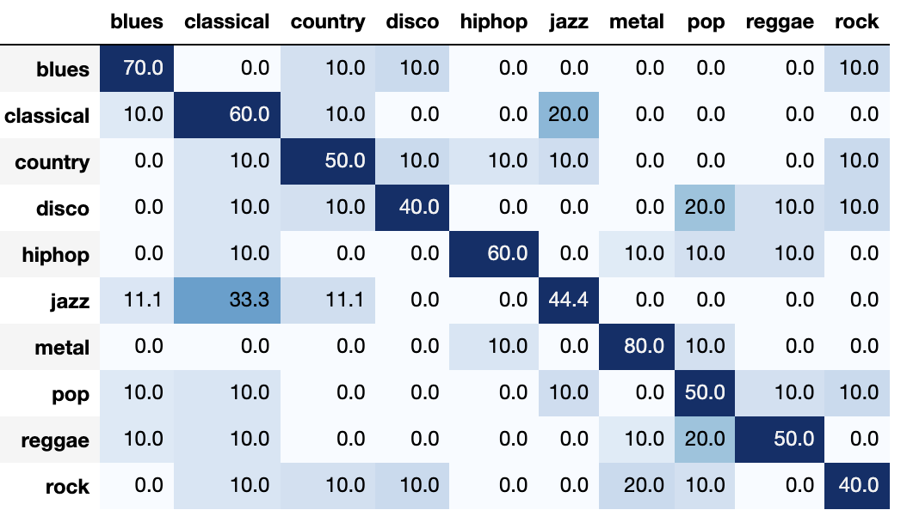
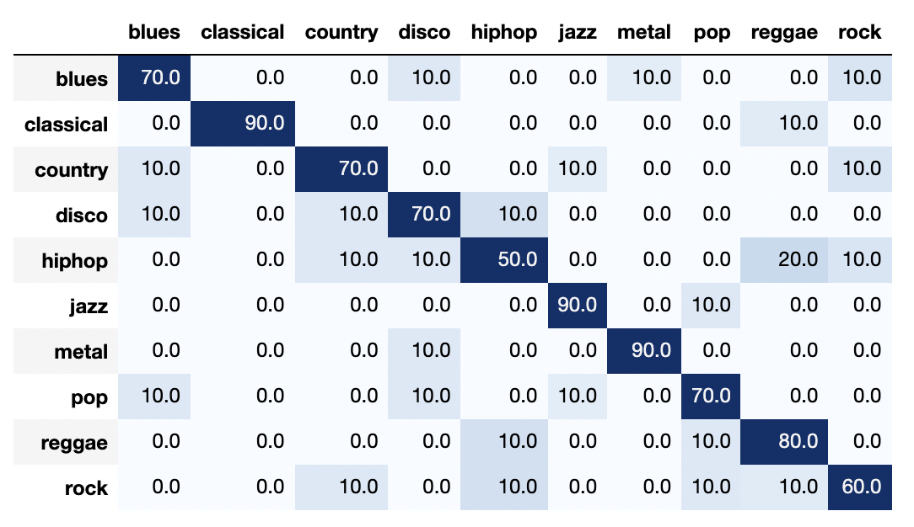
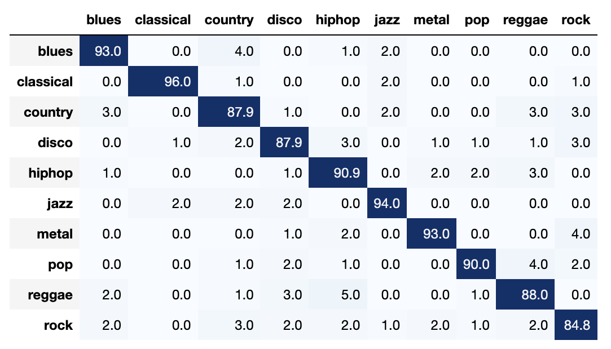

# Music Genre Classification

Sheikh Mannan 
sheikh.mannan@colostate.edu 
CSU CS-542 
Project Report 

## Introduction

Music Genre Classification has been an ongoing problem in the Machine Learning community. There are multiple approaches one can take to solve the problem. Some classifiers extract features from the audio itself. These features tend to represent some semantic meaning about the audio. Standard features used are the Zero Crossing rate, the number of times the audio frequency shifts from positive to negative and back, or Spectral Centroid, which represents the center of mass. More details about some of the audio features used in the experiments are available [here](https://towardsdatascience.com/music-genre-classification-with-python-c714d032f0d8). 

Other classifiers utilize visual representations of audios and feed them to Convolutions Neural Networks(CNNs) compared to Feed-Forward or Fully Connected Networks. This essentially transforms the task from audio classification to image classification. There are multiple ways to convert or translate an audio signal to an image representation of itself. A standard method that we will use is MEL Spectrograms, and more details are available [here](https://medium.com/analytics-vidhya/understanding-the-mel-spectrogram-fca2afa2ce53). The basic gist of MEL spectrograms is that they represent how sound would be perceived by humans on a Mel scale as "humans do not perceive frequencies on a linear scale. We are better at detecting differences in lower frequencies than higher frequencies. For example, we can easily tell the difference between 500 and 1000 Hz. However, we will hardly be able to tell the difference between 10,000 and 10,500 Hz, even though the distance between the two pairs are the same" [2].

This project aimed to determine which classifier/approach is more robust for classifying music genres given either features extracted from the audio signals or images representing the audio signals. 

## Dataset

For this project, I used the GTZAN dataset, which can be found on [kaggle](https://www.kaggle.com/andradaolteanu/gtzan-dataset-music-genre-classification). The dataset on Kaggle has the following properties:

1. 10 genres that have 100 30-seconds songs each. Some genres present are classical, metal, and jazz. 
2. For each song, there is the original audio file, the Mel spectrogram, and the mean and variance of each feature calculated from either the entire 30 seconds song or 3 seconds segments of the song. 

*Note: to replicate any results below, download the data from kaggle and place the unzipped `Data/` dir inside the Project folder. Or you can simply change the dir_paths mentioned at the top of each python notebook.*

## Experiments

I used the following neural networks for my experiments depending on the input type.

|             Input             |       Network Type       |
|:-----------------------------:|:------------------------:|
|    Images/Mel Spectrograms    |  Convolutional Networks  |
| 3/30 seconds average features | Fully Connected Networks |

### Using images

For this part, I tried several different convolutional networks with different number of nuerons, layers, strides, patch sizes and other hyperparameters. The best result for the image classification task was achieved by the following network structure:

* learning rate = 0.005
* batch size = 128
* n_epochs = 5000	
* fully connected layers = []	
* convolutional layers = ([], [], [])   	#  ([units],[patches],[strides])
* validation accuracy = 48.484848	
* test accuracy = 54.545455

The next best convolutional network that actually contained convolutional layers was structure as follows:

* learning rate = 0.005
* batch size = 128
* n_epochs = 5000	
* fully connected layers = []	
* convolutional layers = ([50, 50], [40, 10], [10, 5])  	#  ([units],[patches],[strides])
* validation accuracy = 43.434343	
* test accuracy = 31.313131

The different network structures and hyperparameters tried can be found in `image_analysis.ipynb`. I also thought about using pre-trained image classifiers like ResNet or AlexNet, but I did not follow this route. The main reason was that such classifiers had trained on entirely different sets of images. Features learned by the convolutional layers would extract entirely different features resulting in a classifier performing even worse than chance.

### Using features

Using the above methodology, I tried several different network structures and hyperparamters for the 30 and 3 seconds averaged features. The best networks are as follows:

* 30 seconds averaged features:
    * learning rate = 0.01
    * batch size = 100
    * n_epochs = 5000
    * activation function = tanh
    * fully connected layers = [50]	
    * validation accuracy = 76.0	
    * test accuracy = 74.0 
    
* 3 seconds averaged features:
    * learning rate = 0.005
    * batch size = 200
    * n_epochs = 1000
    * activation function = relu
    * fully connected layers = [100, 250, 250, 100]
    * validation accuracy = 90.050251	
    * test accuracy = 88.844221

The above results show that classifying a song using features extracted from 3-second segments provides more information to its genre than using features from the entire song itself. This suggests that using features averaged over more extended periods either lose localized/segmented features that are more prominent and indicative of a song's genre. Other network structures and hyperparameters tried for classifiers using the audio features can be found in `3secs_features_analysis.ipynb` or `30secs_features_analysis.ipynb`. Note: at the end of 3 seconds analysis notebook, I combined the averaged 3-second features for each song to determine whether that would help classify each song as a whole better. The best testing accuracy I achieved was about 65% which was worse than the accuracy for the averaged 30-second features.

## Results

Below are the results from the test set for each of the best networks shown above:

* Image classifier

* 30-second features

* 3-second features

I have noticed that some genres like metal, classical, and blues are always more correctly classified by each network I tested. There could be several reasons why this may occur:

1. The features extracted/learned maybe more unique for some genres than others. For this to be true, almost all songs in the genre should be pretty similar.
2. Misclassified genres do not have an overlapping theme/structure within their genre. Some songs could also be classified as some other genre. For example, rock was the worst-performing genre for each of the 3 classifiers, maybe because some of its songs were more indicative of other genres. One possible reason could be that the actual labels assigned to the songs are incorrect or could use some review. Since the GTZAN dataset is quite a famous dataset in audio classification, I assume the latter reason to be more unlikely. 

Overall the fully connected networks did perform better than the image classifiers. We should still be aware that the image classifier was accurate about 50% of the time which is much better than random choice. 

## Further improvements

There may be a correlation or 1-1 mapping between the audio features and features extracted by the convolutional layers for the images. Generating these mappings could show some new insights into audio classification. Due to a shortage of time, I could not further investigate what features were favored by fully connected networks and what features were learned by the convolutional layers. Other improvements in the approach to genre classification are to train recurrent neural networks or maybe even transformers on the audio signals themselves. A new class of continuous-time networks specializing in time-series prediction tasks may perform better if we train them on segments of the audio signals themselves [4]. 

## References

1. https://towardsdatascience.com/music-genre-classification-with-python-c714d032f0d8
2. https://medium.com/analytics-vidhya/understanding-the-mel-spectrogram-fca2afa2ce53
3. https://www.kaggle.com/andradaolteanu/gtzan-dataset-music-genre-classification
4. https://arxiv.org/abs/2006.04439

## Code

The following code files were adapted from either CS445 or CS545
* `cnn2d.py`
* `mlfuncs.py`
* `neuralnetworks.py`
* `nnclassifier.py`
* `optimizers.py`
* `utils.py`
